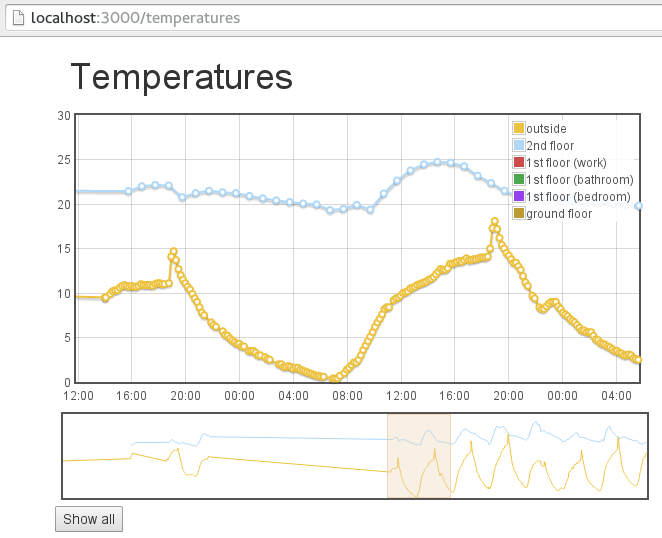

This is a simple demo web application.

Only purpose: Display temperature data recorded with a Raspberry Pi (RPi).

This code is intended to run on the same RPi as the data is recorded on.

If running the command `npm start` and visiting [http://localhost:3000/](http://localhost:3000/) does not work, please see below.

Otherwise visit [http://localhost:3000/temperatures](http://localhost:3000//temperatures).

## TL;DR Build instructions

Prerequisites: 

- [node.js](https://nodejs.org/)
- [Bower.js](http://bower.io/)

```
npm install
```
`npm install`: gets the backend dependencies (ie express.js, sqlite3-api for express).

```
bower install
```
`bower install`: gets the frontend dependencies.

## Quick test

```
npm start
```

Then open your browser at [http://localhost:3000/](http://localhost:3000/). Test for express.js

Then open your browser at [http://localhost:3000/temperatures](http://localhost:3000//temperatures). Tests the rest

Should look something like this:



## Production setup

```
export SET_ENV=production
npm start
```

## TODOs

- ~~legend: placement outside of plot~~
- ~~legend: select which data set to display~~
- ~~legend: checkbox, color box and label should be side by side~~
- ~~Changing selected time series should not alter selection range~~
- ~~tooltip should show all y values for selected x value (requires data interpolation, check available plugins)~~
- ~~detail plot: add panning functionality~~
- ~~initial load: last 14 days~~
- ~~dynamically load older data when scrolling in overviewplot left (ajax). Return the previous fortnight~~
- ~~show 'loading spinner gif' for slow ajax requests. Must have, since the REST API on RPi can take up to 10 seconds to return a result~~
- ~~dynamically load older data when panning in detailplot left (ajax)~~
- ~~overview plot: fix margins~~
- ~~plots: remove grid borders~~
- ~~detail plot: highlight grid dependent on selected range:~~
    - ~~highlight weekends (sample at http://www.flotcharts.org/flot/examples/visitors/index.html),~~
    - ~~higlight night time (sunrise/sunset)~~
        - ~~external API (f.ex. http://sunrise-sunset.org/api)~~
        - ~~calculated sunrise/sunset values (f.ex. https://github.com/mourner/suncalc)~~
- add buttons for selecting specific ranges (ie last 24h, last week, last month) and jumping to previous/next range.
- Statistics
